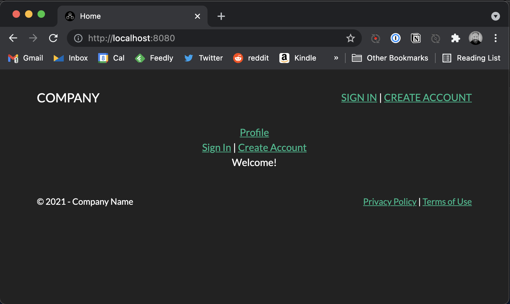
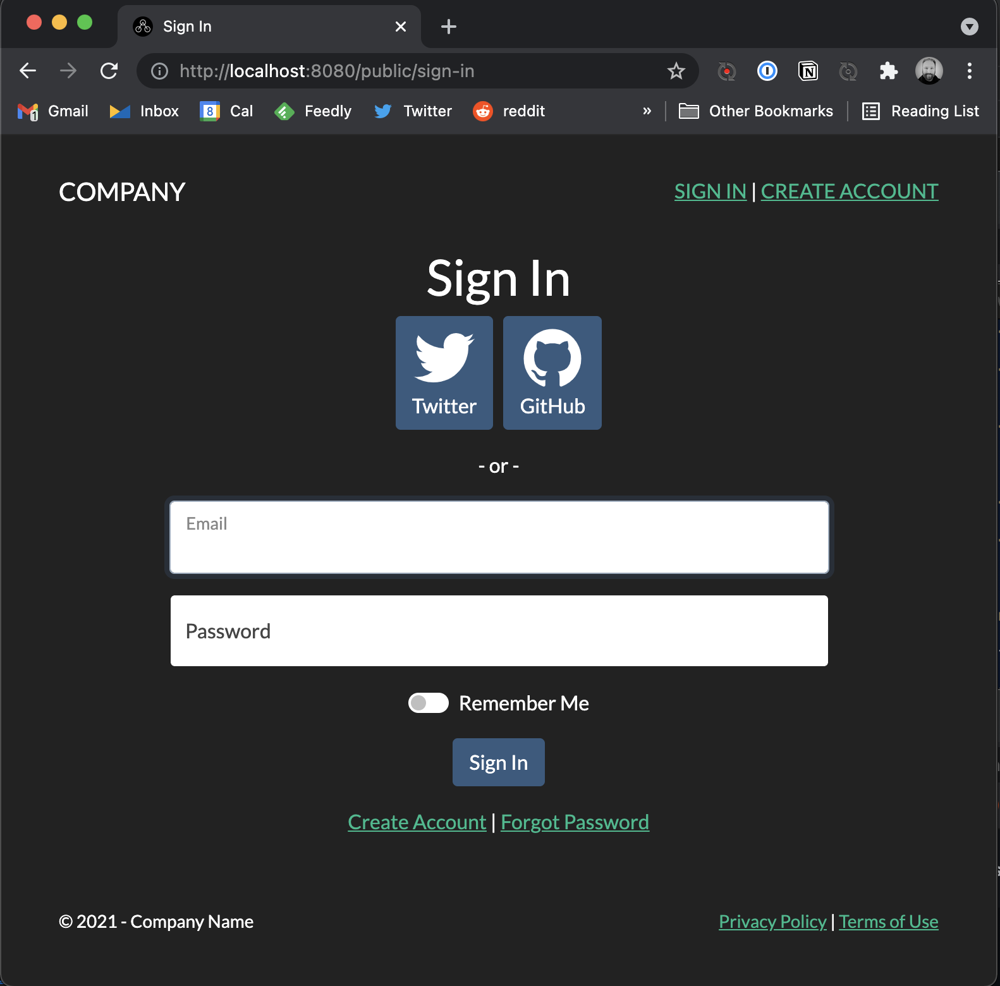
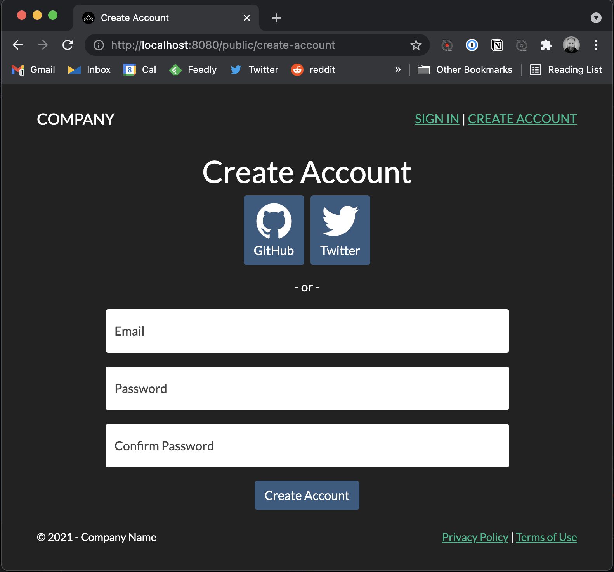
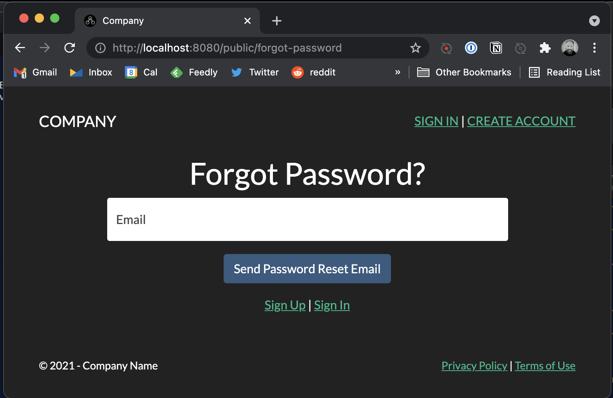
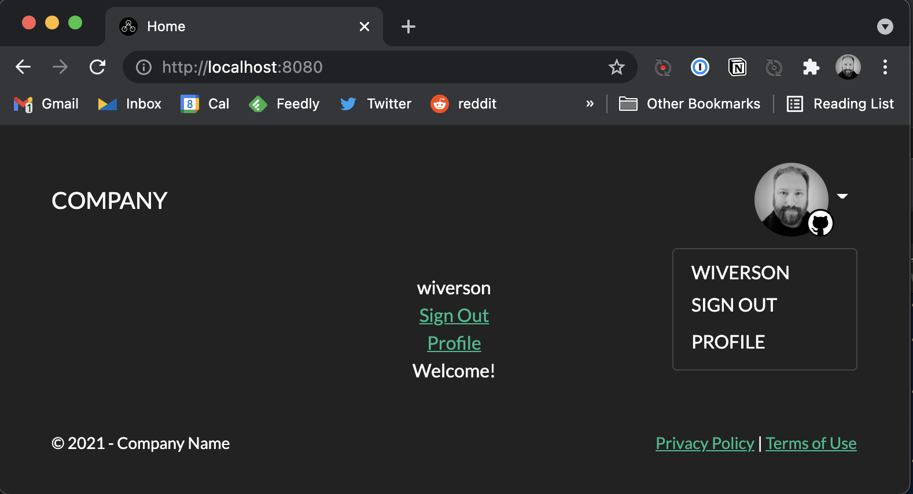
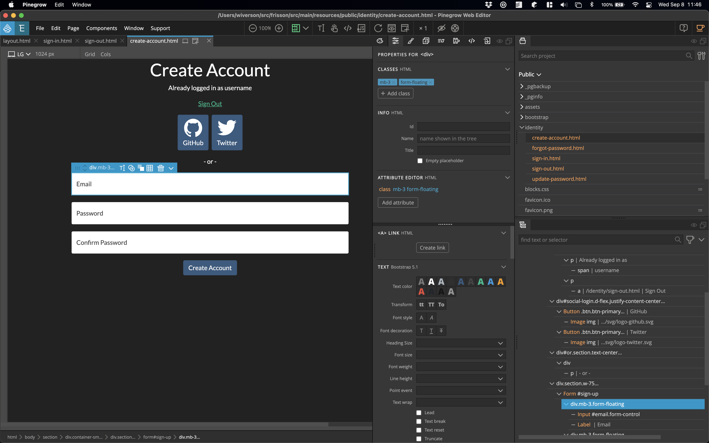
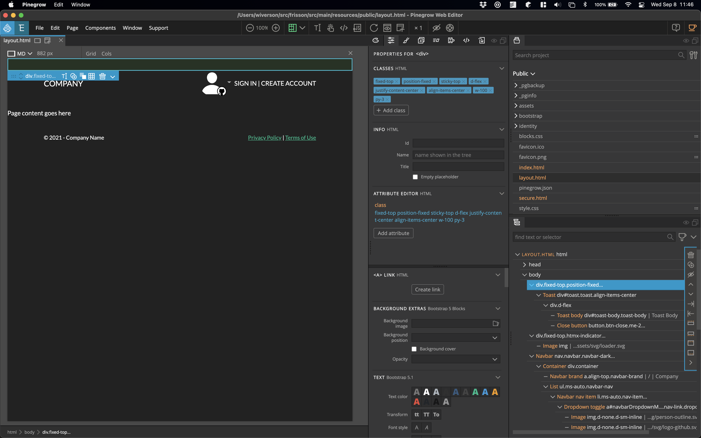
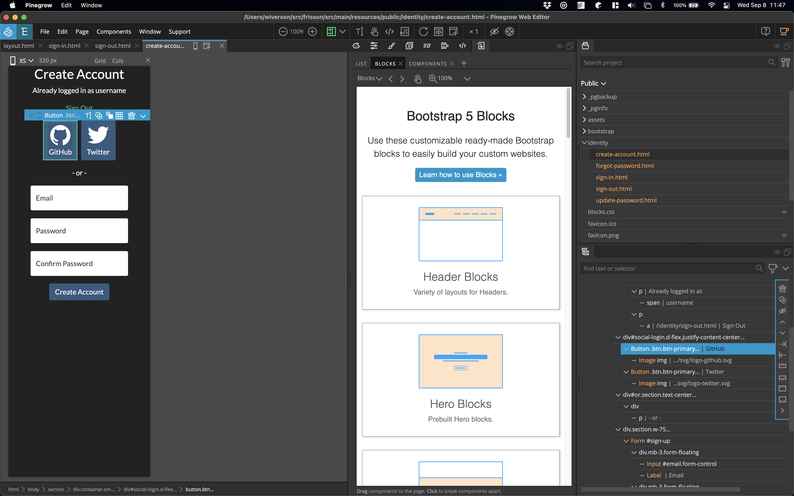
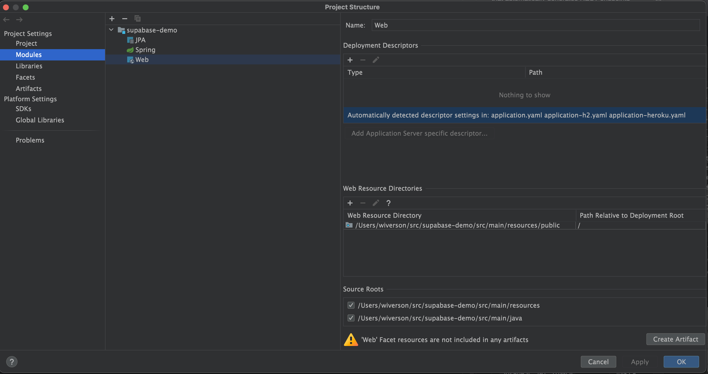

# Easy, Powerful Full Stack Spring Boot

Build slick, fast Spring Boot full stack web applications easily as a solo developer.

This project is specifically designed to make it easy to build a modern web application with Spring Boot.

Here's a list of features:

- Uses [Supabase.io](https://supabase.io) as the core for RDBMS, auth, storage.
    - [Supabase is an open source platform](https://github.com/supabase/supabase) that offers
      hosted [Postgres](https://www.postgresql.org/) with built-in integration with a variety of services, including
      [simplified authentication](https://supabase.io/docs/guides/auth)
      and [storage](https://supabase.io/docs/guides/storage).
    - This project specifically uses Supabase for auth (including seamless Spring Security support!) and as a hosted
      Postgres instance.
    - There's a lot more on Supabase later in this document. :)
- Because Supabase is just Postgres, that means you can use all of [IntelliJ's](https://www.jetbrains.com/idea/) RDBMS
  features, including [JPA Buddy](https://www.jpa-buddy.com/).
    - This means that everything is type-aware (auto-complete FTW!) from the RDBMS through the Java code and into the
      Thymeleaf templates!
- Reconfigured the [Thymeleaf](https://www.thymeleaf.org/) settings for compatibility
  with [Pinegrow](https://pinegrow.com/) visual HTML builder
- Uses [Bootstrap](https://getbootstrap.com/) as a default CSS framework
    - Drop in a [new Bootstrap theme](https://github.com/thomaspark/bootswatch) with minimal fuss!
    - If you want to switch to TailwindCSS instead, no big deal.
- Use [HTMX](https://htmx.org/) and Thymeleaf Fragments to provide
  [rich, dynamic partial page updates](https://changenode.com/articles/easy-full-stack-java)
  without using any complicated JavaScript frameworks.
- Stateless by default - uses [Supabase JWT](https://supabase.io/docs/learn/auth-deep-dive/auth-deep-dive-jwts) for
  authorization, so the project defaults to turning off Java sessions to improve ease of scaling.
    - TIP: Use service level [Spring Boot caching](https://spring.io/guides/gs/caching/) instead of the antiquated
      session API to take the load of a database instead the session API.

# Screenshots

The default theme is the open source Bootstrap
theme [Darkly](https://github.com/thomaspark/bootswatch/tree/v5/dist/darkly), which just happens to be very similar to
the default Supabase theme. You can swap in another theme (e.g. another [Bootswatch](https://bootswatch.com/) theme) or
build your own via SASS or the Pinegrow Design editor.

## Basic Features

The default home screen displayed to the user.

Log in with either a social provider or email/password. Supabase supports
many [other providers](https://supabase.io/auth)!

Create an account quickly and easily. Supabase sends the various emails (confirmation, forgot password) for you. If you
want to use your own SMTP server, pop in the SMTP credentials into Supabase.

This project includes the JavaScript to handle the forgot password flow.

Logged in Supabase information is available both via standard Spring Security (via principal) and via a bean wrapper (
makes it easier to work with in Thymeleaf).

## Thymeleaf Visual Editing

Shows how the Create Account page can be viewed visually. Use the Pinegrow built-in HTML code editor or tab back and
forth with IntelliJ.

This is the master layout used throughout the template. Also can be edited visual and/or via code editor.

Pinegrow handles responsive design quickly and easily. Just press a single keystroke to view the different breakpoints.
Visually assign styling based on breakpoints.

# Getting Started

## Basics

You'll need Java 16+ and Maven.

## Supabase

You will need to set up a new [Supabase.io](https://supabase.io/) project. You can start with the free starter version.
Eventually you can switch to either a [paid account](https://supabase.io/pricing) or set up your
own [self-hosted version](https://supabase.io/docs/guides/self-hosting).

## Configuration

Set the following environment values so Maven and Spring Boot can find them. Tip: if you declare them in a .profile on
macOS, IntelliJ will pick them up.

| VALUE | Typical Values |
| ----- | --- |
| `SUPABASE_DATABASE_URL` | jdbc:postgresql://db.PROJECT.supabase.co/postgres |
| `SUPABASE_DATABASE_USER` | postgres |
| `SUPABASE_DATABASE_PASSWORD` | Same as your Supabase login password. |
| `SUPABASE_URL` | https://PROJECT.supabase.co |
| `SUPABASE_ANON_KEY` | A JWT with the role of anon. Verify it at https://jwt.io/ |
| `SUPABASE_JWT_SIGNER` | The TOP SECRET key used for signing JWT from Supabase. DO NOT SHARE THIS - anyone who has this can create new identity JWTs - basically, this is a super password that would allow anyone to impersonate anyone on the site! |

## Database

By default, this template points to the Supabase table and expects to find a user table and a todo table. If you are
playing around, you might want to try creating a matching table. Otherwise, just go ahead and delete
the [todo entity and query files](https://spring.io/guides/gs/accessing-data-jpa/):

`src/main/java/com/changenode/frisson/data/ToDo.java`
`src/main/java/com/changenode/frisson/query/TodosEntityQuery.java`

## IntelliJ Setup

This project uses the src/main/resources/public directory to store the html files.

In IntelliJ, make sure you set up the Web module to point at src/main/resources/public directory. Otherwise you will get
errors related to paths in IntelliJ.

# Help

This entire project is built on top of a large number of well-documented open source projects, such as Spring Boot,
Bootstrap, Postgres, Thymeleaf, Supabase, and HTMX, just to name a few. Most of your issues or questions are probably
going to be solved by the usual combination of the project documentation, Google, Stack Overflow, etc.

That said, here are some options specific to this project:

- Check out the [discussion board](https://github.com/ChangeNode/frisson/discussions).
- File an [issue](https://github.com/ChangeNode/frisson/issues).

If you need consulting support, [feel free to reach out](https://changenode.com/contact).

# Additional Supabase Information

## Supabase PostREST and Spring Boot

By default, Supabase makes data available to the browser using [PostREST](https://postgrest.org/) - an application that
automatically generates REST endpoints for a relational database.

Java web frameworks, on the other hand, usually connect directly to the database.

Which is better? If you are a Java developer used to working with Spring Boot and Spring data repositories, just use
that. Keep your tables private in Supabase connect just like you would with any ordinary Postgres instance.

If you want to use PostREST, that's fine - just be absolutely sure you are setting up row-level security correctly!

# Remember Me

The "Remember Me" setting in the login user interface, if checked, will store the JWT in a cookie, which will then allow
the server to immediately render the logged-in user as long as the JWT has not expired.

The default for JWT tokens on Supabase is 3600 seconds (1 hour). As long as the user is actively clicking around on the
website, the Supabase.js client will automatically refresh with new JWT tokens.

This means, however, that the "Remember Me" feature will only work for up to 1 hour. If you want to extend this, go to
the Authentication -> Settings -> JWT Expiry and change it to something longer. The maximum setting allowed (one week)
means that as long as the user logs into the site at least once a week, they will effectively never have to log in
again.

The only downside is that you can't easily revoke a JWT once issued. So, if you extend the JWT session, that's the login
time. If you want to implement some kind of instant user ban, you can still use JWT but you will need to add additional
logic.

# More Information

### Bootstrap Themes

This project uses the Bootstrap 5.1 theme from:

https://github.com/thomaspark/bootswatch/tree/v5/dist/darkly

You can drop in other themes from:

https://github.com/thomaspark/bootswatch/

Or you can use the built-in Pinegrow SASS compiler to build your own Bootstrap themes.

### SVG Icons

The SVG Icons in this project are from:

https://ionic.io/ionicons

### Reference Documentation

For further reference, please consider the following sections:

* [Official Apache Maven documentation](https://maven.apache.org/guides/index.html)
* [Spring Boot Maven Plugin Reference Guide](https://docs.spring.io/spring-boot/docs/2.5.3/maven-plugin/reference/html/)
* [Create an OCI image](https://docs.spring.io/spring-boot/docs/2.5.3/maven-plugin/reference/html/#build-image)
* [Spring Boot DevTools](https://docs.spring.io/spring-boot/docs/2.5.3/reference/htmlsingle/#using-boot-devtools)
* [Spring Web](https://docs.spring.io/spring-boot/docs/2.5.3/reference/htmlsingle/#boot-features-developing-web-applications)
* [Thymeleaf](https://docs.spring.io/spring-boot/docs/2.5.3/reference/htmlsingle/#boot-features-spring-mvc-template-engines)
* [Spring Data JPA](https://docs.spring.io/spring-boot/docs/2.5.3/reference/htmlsingle/#boot-features-jpa-and-spring-data)

### Guides

The following guides illustrate how to use some features concretely:

* [Serving Web Content with Spring MVC](https://spring.io/guides/gs/serving-web-content/)
* [Handling Form Submission](https://spring.io/guides/gs/handling-form-submission/)
* [Accessing Data with JPA](https://spring.io/guides/gs/accessing-data-jpa/)

